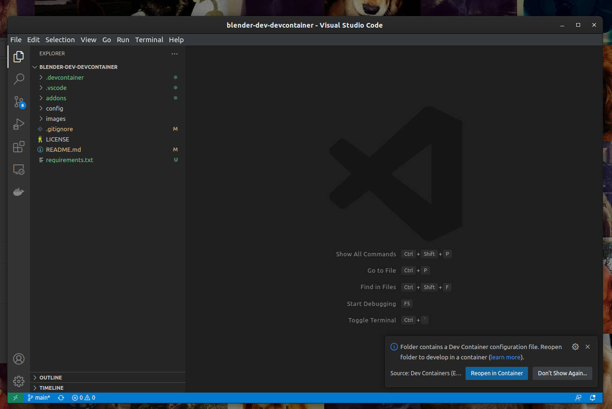
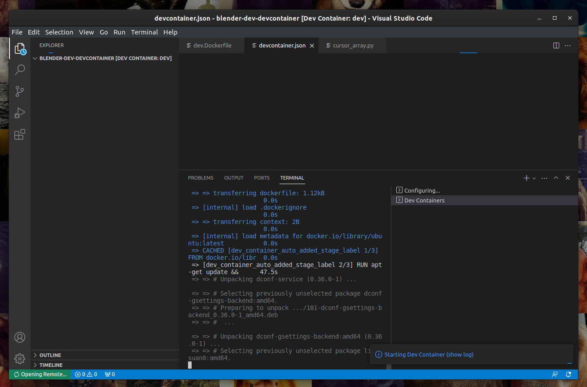
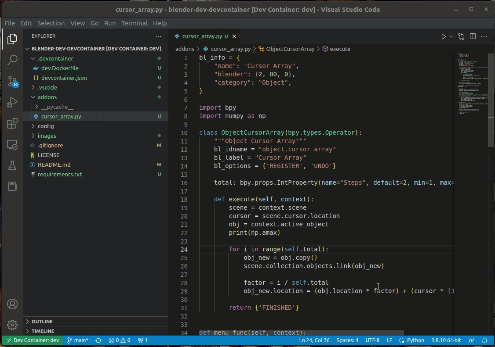

# blender-devcontainer

This repository is a template for a simple devcontainer-based plugin development setup for Blender. It allows you to launch Blender with one click and interactively debug any Python plugins directly in VS Code with no extra steps. It was created to quickly and easily develop plugins for Blender without mucking with paths and with the full debugging, refactoring, linting and testing capabilities of Python in VS Code. What's more, the Blender plugin shows full intellisense and debugging data for `bpy` and other packages in Blender. You can also install any custom packages using `requirements.txt` and they will be available to use in your Blender plugin.

This template has been tested on Ubuntu on NVIDIA GPU with Docker. YMMV on other OSes, GPUs and containerization technologies.

## Getting Started

You will need the following pieces of software installed on your host system.

* [VS Code](https://code.visualstudio.com/)
* [VS Code remote development extension pack](https://marketplace.visualstudio.com/items?itemName=ms-vscode-remote.vscode-remote-extensionpack)
* [Docker + Nvidia container runtime](https://docs.nvidia.com/datacenter/cloud-native/container-toolkit/install-guide.html)

Note that this is common infrastructure if you use GPU-accelerated devcontainers on your system and only needs to be installed on for any number of devcontainer-enabled repositories you want to use. Now that you have the tools needed, simply open your workspace folder in VS Code. When you do, it should look like this.

You can now click "Reopen in Container", or choose it from the [command palette](https://code.visualstudio.com/docs/getstarted/userinterface#:~:text=Command%20Palette,for%20the%20most%20common%20operations. "VS Code command palette"). When you do, VS code will build the container, install dependencies, set up environment variables, paths, etc.

Once it's done, you're all set. You can now open your Blender plugin and begin debugging!

And that's all it takes!
